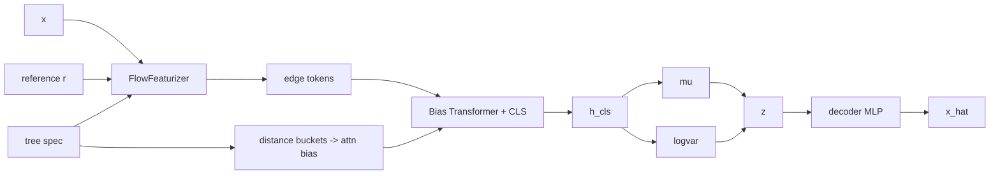

# FlowXFormerVAE Theory and Mathematical Formulation

This document formalizes `FlowXFormerVAE` in `src/biomevae/models/flowxformer.py`.

## 1. Tree and flow featurization
Given rooted taxonomy tree \(\mathcal T=(V,E)\), each sample \(x\in\mathbb R_+^p\) is converted to edge-flow features relative to reference composition \(r\).

Let \(p_{\text{leaf}}\) be normalized leaf mass (or root-L1 scaled mass in UOT mode). Propagate leaf differences upward:
\[
\Delta_v = \sum_{\ell\in\mathrm{leaves}(v)}(p_{\ell}-r_{\ell}),
\qquad
f_e = \Delta_{\mathrm{child}(e)}.
\]

For each edge token, model uses 5 channels:
\[
\tau_e = [\operatorname{asinh}(f_e),\operatorname{asinh}(|f_e|),\ell_e,d_e,\log(1+m_e)],
\]
where \(\ell_e\)=edge length, \(d_e\)=edge depth, \(m_e\)=subtree mass.

If `uot_mode="root_l1"`, append a virtual token encoding root mismatch \(\Delta_{\text{root}}\).

## 2. Distance-biased transformer encoder
Edge-edge topological distances are bucketed to build learned attention bias matrix \(B\). With token embeddings \(T\), self-attention uses:
\[
\mathrm{Attn}(Q,K,V)=\mathrm{softmax}\!\left(\frac{QK^\top}{\sqrt d}+B\right)V.
\]

A learnable CLS token is prepended; final encoder representation is CLS output \(h_{\mathrm{cls}}\).

## 3. Variational head and decoder
\[
(\mu,\log\sigma^2)=W[h_{\mathrm{cls}}]+b,
\quad z=\mu+\sigma\odot\varepsilon,
\quad \hat x=f_\theta(z).
\]

Thus the model is a VAE whose encoder is a tree-flow transformer rather than a plain MLP.

## 4. Objective
Training uses the shared VAE objective:
\[
\mathcal J(x)=\mathcal L_{\text{rec}}(x,\hat x)+\beta_t\,\mathrm{KL}(q_\phi(z\mid x)\|\mathcal N(0,I)).
\]
The helper `flow_vector(x)` exposes \(\operatorname{asinh}(f_e)\) for analysis.

## 5. Diagram

