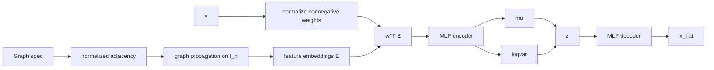

# TaxonomyGraphVAE Theory and Mathematical Formulation

This document formalizes `TaxonomyGraphVAE` in `src/biomevae/models/graph.py` and the graph pooling encoder in `src/biomevae/models/taxonomy_graph.py`.

## 1. Graph-preconditioned feature embeddings
Let taxonomy graph have \(n\) nodes and weighted adjacency \(A\). The encoder builds
\[
\tilde A = A + I,
\qquad
\hat A = D^{-1/2}\tilde A D^{-1/2},
\]
where \(D_{ii}=\sum_j \tilde A_{ij}\).

Node-initial features are one-hot identity rows \(H^{(0)}=I_n\). Each propagation layer is
\[
H^{(\ell+1)} = \sigma\!\left(\hat A H^{(\ell)}W^{(\ell)} + b^{(\ell)}\right).
\]
Feature-node embeddings are selected by an index set \(S\subset\{1,\dots,n\}\):
\[
E = H^{(L)}_{S,:}\in\mathbb R^{p\times d_g}.
\]

## 2. Sample pooling on graph features
For input sample \(x\in\mathbb R^p\), weights are shifted/clamped to be nonnegative and normalized:
\[
w_i\ge 0,\qquad \sum_i w_i=1.
\]
(Uniform fallback if the sum is zero.)
The pooled sample representation is
\[
r(x)=\sum_{i=1}^p w_i E_i = w^\top E \in\mathbb R^{d_g}.
\]

## 3. Variational model
Encoder MLP maps \(r(x)\) to Gaussian parameters:
\[
(\mu,\log\sigma^2)=g_\phi(r(x)),
\qquad
q_\phi(z\mid x)=\mathcal N(\mu,\operatorname{diag}(\sigma^2)).
\]
Prior: \(p(z)=\mathcal N(0,I)\). Reparameterization:
\[
z=\mu+\sigma\odot\varepsilon,\quad \varepsilon\sim\mathcal N(0,I).
\]
Decoder MLP reconstructs
\[
\hat x=f_\theta(z).
\]

## 4. Objective
Used with shared training losses:
\[
\mathcal J(x)=\mathcal L_{\text{rec}}(x,\hat x)+\beta_t\,\mathrm{KL}(q_\phi(z\mid x)\|p(z)).
\]

## 5. Diagram

