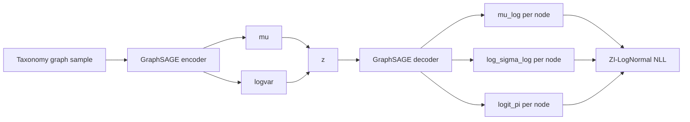

# HGVAE-ZI Theory and Mathematical Formulation

This document formalizes `HGVAE_ZI` in `src/biomevae/models/hgvae_zi.py`.

## 1. Graph-structured encoder
For each sample, a taxonomy graph with node features
\[
[x_v,\mathrm{emb}_{\text{rank}}(v),\mathrm{emb}_{\text{type}}(v)]
\]
is passed through GraphSAGE layers. Global mean+max pooling yields graph representation \(h_g\), then
\[
(\mu,\log\sigma^2)=g_\phi(h_g),
\quad q_\phi(z\mid x)=\mathcal N(\mu,\operatorname{diag}(\sigma^2)).
\]

## 2. Node-level ZI-LogNormal decoder
Given sample latent \(z\), broadcast to nodes and run GraphSAGE decoder to predict, per node \(v\):
\[
\mu_v^{\log},\quad \log\sigma_v^{\log},\quad \operatorname{logit}(\pi_v).
\]
Interpretation:
- with probability \(\pi_v\): structural zero,
- otherwise \(\log X_v\sim \mathcal N(\mu_v^{\log},\sigma_v^{2,\log})\).

Expected abundance:
\[
\mathbb E[X_v]=(1-\pi_v)\exp\!\left(\mu_v^{\log}+\tfrac12\sigma_v^{2,\log}\right).
\]

## 3. ZI-LogNormal negative log-likelihood
For observed \(x\):
\[
\mathcal L_{\text{zi-ln}}(x)=
\begin{cases}
-\log \pi, & x=0,\\
-\log(1-\pi)+\mathcal L_{\mathcal N}(\log(x+\epsilon);\mu^{\log},\sigma^{\log})+\log(x+\epsilon), & x>0,
\end{cases}
\]
where the last term is Jacobian correction from \(x\to\log x\).

## 4. Additional regularizers in training utilities
1. **Hierarchical consistency loss** (internal node vs sum of children, in log-space):
\[
\mathcal L_{\text{hier}} = \frac1{|\mathcal I|}\sum_{v\in\mathcal I}
\left|\log(\hat x_v+\epsilon)-\log\!\left(\sum_{u\in\mathrm{ch}(v)}\hat x_u+\epsilon\right)\right|.
\]
2. **Latent smoothness from affinity matrix \(A\):**
\[
\mathcal L_{\text{smooth}} = \frac{1}{n^2}\sum_{i,j}A_{ij}\|\mu_i-\mu_j\|_2^2.
\]

## 5. Full objective pattern
\[
\mathcal J = \mathcal L_{\text{zi-ln}} + \beta_t\,\mathrm{KL}(q_\phi\|\mathcal N(0,I)) + \lambda_h\mathcal L_{\text{hier}} + \lambda_s\mathcal L_{\text{smooth}}.
\]
(Weights set by training script configuration.)

## 6. Diagram

