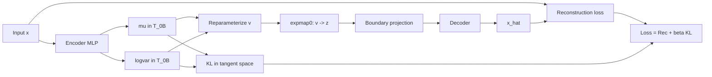

# Hyperbolic VAE Theory and Mathematical Formulation

This document formalizes the HyperbolicVAE implemented in `src/biomevae/models/hyperbolic.py`, where latent variables live on a Poincaré ball while inference is performed through tangent-space Gaussian parameterization.

---

## 1. Latent manifold geometry

Let \(c>0\) be curvature magnitude. The Poincaré ball model is
\[
\mathbb B_c^d = \{u\in\mathbb R^d : c\|u\|_2^2 < 1\},
\]
with constant sectional curvature \(-c\).

The Riemannian metric tensor is conformal:
\[
g_u = \lambda_u^2 I_d,
\qquad
\lambda_u = \frac{2}{1-c\|u\|_2^2}.
\]

At the origin, tangent space \(T_0\mathbb B_c^d\cong\mathbb R^d\), enabling Gaussian reparameterization in Euclidean coordinates.

---

## 2. Variational family in tangent space

Given input \(x\in\mathbb R^p\), encoder MLP outputs
\[
(\mu_\phi(x),\log\sigma_\phi^2(x)).
\]
Define tangent-space posterior:
\[
q_\phi(v\mid x)=\mathcal N\big(\mu_\phi(x),\operatorname{diag}(\sigma_\phi^2(x))\big),
\qquad v\in T_0\mathbb B_c^d.
\]
Sample with reparameterization:
\[
v = \mu_\phi(x)+\sigma_\phi(x)\odot\varepsilon,
\qquad \varepsilon\sim\mathcal N(0,I_d).
\]

Map to manifold by exponential map at origin:
\[
z = \exp_0^{\mathbb B_c}(v).
\]
In implementation, a projection step clips points away from the boundary for numerical stability.

---

## 3. Exponential and logarithmic maps at the origin

For the Poincaré ball of curvature \(-c\), writing \(\|v\|=r\):
\[
\exp_0^{\mathbb B_c}(v)
= \tanh\!\big(\sqrt c\,r\big)\frac{v}{\sqrt c\,r},
\]
with the continuous extension \(\exp_0(0)=0\).

Conversely, for \(z\in\mathbb B_c^d\),
\[
\log_0^{\mathbb B_c}(z)
= \frac{1}{\sqrt c}\operatorname{artanh}(\sqrt c\,\|z\|)\frac{z}{\|z\|}.
\]

These formulas explain why Gaussian sampling is done in tangent coordinates and only then pushed to the manifold.

---

## 4. Decoder and reconstruction model

The decoder consumes manifold coordinates \(z\) and predicts \(\hat x\in\mathbb R^p\):
\[
\hat x = f_\theta(z).
\]

As in the Euclidean training loop, reconstruction uses configurable surrogate losses (MSE/MAE/Huber).

---

## 5. KL regularization used in practice

The implemented KL term is computed from tangent-space Gaussian parameters:
\[
\mathrm{KL}_{\mathrm{tan}}\big(q_\phi(v\mid x)\|\mathcal N(0,I_d)\big)
=\frac12\sum_{j=1}^d\left(\mu_j^2+\sigma_j^2-1-\log\sigma_j^2\right).
\]

Thus the practical objective is
\[
\mathcal J_{\mathrm{hyp}}(x)
=\mathcal L_{\mathrm{rec}}(x,\hat x)
+\beta_t\,\mathrm{KL}_{\mathrm{tan}}.
\]

Warmup schedule:
\[
\beta_t=\min\!\left(\beta_{\max},\beta_{\max}\frac{t}{T_{\mathrm{warmup}}}\right).
\]

---

## 6. Geometric interpretation

1. The encoder learns tangent vectors that summarize uncertainty in a locally Euclidean chart.
2. The exponential map warps these vectors into a negatively curved latent space where hierarchical structures can be represented with lower distortion.
3. The decoder operates on manifold coordinates and reconstructs observations in data space.

Hyperbolic geometry is especially useful when latent relations are approximately tree-like.

---

## 7. Diagram (hyperbolic inference pipeline)

---

## 8. Notes on rigor vs implementation

- A fully manifold-consistent variational treatment would define both posterior and prior directly as distributions on \(\mathbb B_c^d\) with metric-volume corrections.
- The current implementation uses the standard and stable tangent-space approximation (Gaussian KL in \(T_0\mathbb B_c^d\)), which is common in practical hyperbolic VAEs.
- This preserves optimization simplicity while still injecting hyperbolic inductive bias through \(z=\exp_0(v)\).
