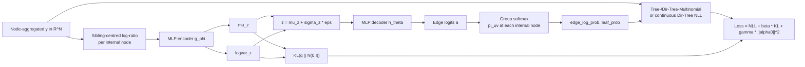

# Tree-Dirichlet-Tree-Multinomial VAE (TreeDTM-VAE) — Theory

This document derives the **TreeDTMVAE** model implemented in
`src/biomevae/models/tree_dtm_vae.py`. It replaces the previous TreeNB-VAE
formulation, which paired a tree-softmax decoder with an *independent*
Negative-Binomial likelihood on each leaf. The new formulation respects the
tree by placing the likelihood **at every internal node** as a product of
local sibling-split distributions, so dispersion is learned per clade rather
than per unrelated leaf.

The CLI entry point is `biomevae-train-tree-dtm` (see `pyproject.toml`).

---

## 1. Setup

Let

- \(\mathcal T\) be a rooted taxonomy tree with internal nodes
  \(\mathcal I\) and leaves \(\mathcal L\),
- \(L = |\mathcal L|\) the number of leaves (observed taxa),
- \(N\) the total number of nodes (internal + leaves),
- for each internal node \(u \in \mathcal I\), let
  \(\mathrm{Ch}(u)\) be its ordered child set, and write
  \(K_u = |\mathrm{Ch}(u)|\),
- \(\mathcal G = \{(u, \mathrm{Ch}(u)) : u \in \mathcal I\}\) the *sibling
  groups* — exactly one per internal node — indexed by \(g\) with
  \(K_g = K_u\).

Observed data per sample \(i\) is a non-negative vector
\(\mathbf y^{(i)} \in \mathbb R^N_{\ge 0}\) **aligned to every node**
(`taxonomy_tree.aggregate_leaf_matrix_to_nodes`): the leaf entries are the
raw observations and every internal entry is the sum of its children. The
encoder consumes this node tensor; the likelihood reads only the children of
each internal node from it.

The TreeTopology dataclass exposes the relevant arrays
(`group_child_nodes`, `group_child_mask`, `sibling_ranges`, etc.); see
`build_tree_topology()` for construction from a `TaxonomyGraph`.

---

## 2. Generative model

A standard Gaussian prior on the latent:

\[
\mathbf z^{(i)} \sim \mathcal N(\mathbf 0, I_d).
\]

A decoder produces **local split logits** at every internal node:

\[
\mathbf a^{(i)} = h_\theta(\mathbf z^{(i)}) \in \mathbb R^{E},
\qquad E = \sum_{u \in \mathcal I} K_u .
\]

A masked softmax over each sibling group yields per-group probabilities:

\[
\pi^{(i)}_{u\to v}
= \frac{\exp(a^{(i)}_{u\to v})}{\sum_{v' \in \mathrm{Ch}(u)} \exp(a^{(i)}_{u\to v'})}
,\qquad v \in \mathrm{Ch}(u).
\]

The likelihood is one of three forms — choose via the `likelihood`
constructor argument.

### 2.1 Tree-Multinomial

For true integer counts and no overdispersion. For each internal node \(u\),
let \(\mathbf x^{(i)}_u = (x^{(i)}_v)_{v \in \mathrm{Ch}(u)}\) be the child
counts and \(n^{(i)}_u = \sum_v x^{(i)}_v\). Independent multinomials over
sibling groups:

\[
p(\mathbf x^{(i)}_u \mid \pi^{(i)}_{u,\cdot})
= \binom{n^{(i)}_u}{x^{(i)}_{u\to v}}\,
\prod_{v \in \mathrm{Ch}(u)} \big(\pi^{(i)}_{u\to v}\big)^{x^{(i)}_{u\to v}}.
\]

Joint log-likelihood:

\[
\log p(\mathbf y^{(i)} \mid \mathbf z^{(i)})
= \sum_{u \in \mathcal I} \log \mathrm{Multinomial}\!\big(
\mathbf x^{(i)}_u; n^{(i)}_u, \pi^{(i)}_{u,\cdot}\big).
\]

Implemented in `TreeDTMVAE.tree_multinomial_nll`.

### 2.2 Dirichlet-Tree-Multinomial (default)

For overdispersed integer counts. A per-group **learnable concentration**
\(\alpha^0_g > 0\) is produced by the decoder
(`TreeDTMDecoder.group_concentration`). The Dirichlet hyperparameter at
group \(g\) is

\[
\boldsymbol\alpha^{(i)}_g
= \alpha^0_g \cdot \boldsymbol\pi^{(i)}_g + \epsilon,
\qquad
\alpha^{(i)}_{g,0} = \sum_v \alpha^{(i)}_{g,v} = \alpha^0_g.
\]

Marginalising the simplex draw yields the Dirichlet-Multinomial PMF for each
internal node:

\[
p(\mathbf x^{(i)}_u \mid \boldsymbol\alpha^{(i)}_g)
= \binom{n^{(i)}_u}{\mathbf x^{(i)}_u}
\cdot \frac{\Gamma(\alpha^{(i)}_{g,0})}{\Gamma(n^{(i)}_u + \alpha^{(i)}_{g,0})}
\cdot \prod_v \frac{\Gamma(x^{(i)}_{u\to v} + \alpha^{(i)}_{g,v})}
                    {\Gamma(\alpha^{(i)}_{g,v})}.
\]

Joint log-likelihood is the sum over internal nodes; per-sample
implementation in `TreeDTMVAE.dirichlet_tree_multinomial_nll`. Dispersion is
**per sibling group** (rank/clade-level), which is the statistically
appropriate granularity for taxonomies.

### 2.3 Dirichlet-Tree (continuous)

For closed relative-abundance data already in \(\Delta^{L-1}\). The model
treats node values as proportions; at every internal node it applies a
Dirichlet density to the **observed child fractions**:

\[
\mathbf q^{(i)}_u
= \mathrm{normalise}\!\big( \mathbf x^{(i)}_u + \eta \big),
\qquad
\log p(\mathbf q^{(i)}_u \mid \boldsymbol\alpha^{(i)}_g)
= \log \Gamma(\alpha^{(i)}_{g,0})
- \sum_v \log \Gamma(\alpha^{(i)}_{g,v})
+ \sum_v (\alpha^{(i)}_{g,v} - 1) \log q^{(i)}_{u\to v},
\]

with a small observation pseudocount \(\eta > 0\) only to keep zeros inside
the Dirichlet support. Internal nodes with zero parent mass are masked out.
Implemented in `TreeDTMVAE.dirichlet_tree_nll`.

---

## 3. Inference model (encoder)

The encoder operates on the **full node-aggregated tensor**
\(\mathbf y^{(i)} \in \mathbb R^N_{\ge 0}\), not just the leaves. Per internal
node \(u\), the encoder computes a **sibling-centred log-ratio** feature

\[
\ell^{(i)}_{u\to v}
= \log(y^{(i)}_v + \tau) - \frac{1}{K_u} \sum_{v' \in \mathrm{Ch}(u)} \log(y^{(i)}_{v'} + \tau),
\]

with pseudocount \(\tau > 0\) (`encoder_pseudocount`, default `0.5`). This
gauge-fixes the within-group degree of freedom — adding a constant to all
children of \(u\) leaves \(\ell\) unchanged — so the encoder feature lives on
the same scale-invariant manifold as the likelihood. The features across
groups are concatenated and pushed through an MLP trunk
(`TreeBalanceEncoder`):

\[
(\boldsymbol\mu^{(i)}_z, \log\boldsymbol\sigma^{(i)2}_z) = g_\phi(\ell^{(i)}),
\qquad
q_\phi(\mathbf z \mid \mathbf y) = \mathcal N(\boldsymbol\mu_z, \mathrm{diag}(\boldsymbol\sigma_z^2)).
\]

Reparameterised sampling:
\(\mathbf z = \boldsymbol\mu_z + \boldsymbol\sigma_z \odot \boldsymbol\varepsilon\),
\(\boldsymbol\varepsilon \sim \mathcal N(\mathbf 0, I_d)\).

---

## 4. Training objective

Per-sample loss:

\[
\mathcal L^{(i)}
= -\log p(\mathbf y^{(i)} \mid \mathbf z^{(i)})
+ \beta_t \, \mathrm{KL}\!\big(q_\phi(\mathbf z \mid \mathbf y^{(i)}) \,\|\, \mathcal N(\mathbf 0, I_d)\big)
+ \gamma \, \mathcal R(\boldsymbol\alpha^0).
\]

- The reconstruction term is one of the three NLLs in §2.
- The KL term has the standard closed form:
  \[
  \mathrm{KL} = \tfrac12 \sum_j \big(\mu_{z,j}^2 + \sigma_{z,j}^2 - 1 - \log \sigma_{z,j}^2\big).
  \]
  A `free_bits` floor per dimension can be applied (Kingma et al. 2016) — see
  `TreeDTMVAE.kl_per_sample`.
- \(\mathcal R(\boldsymbol\alpha^0)\) is a small L2 penalty on the learned
  per-group concentrations (`concentration_l2`, default `1e-4`); it stabilises
  the Dirichlet rate when a sibling group sees only a few observations.

`\beta_t` follows the linear warm-up schedule used everywhere in
`biomevae.trainers` (see `losses.beta_schedule` and `_resolve_kl_warmup`).

---

## 5. Why this replaces TreeNB-VAE

| Aspect | TreeNB-VAE (deprecated) | TreeDTM-VAE (current) |
|---|---|---|
| Decoder output | Edge logits → tree-softmax → leaf simplex | Edge logits → per-group softmax (likelihood reads internal nodes directly) |
| Likelihood | Independent NB on each leaf with leaf-specific \(\theta_\ell\) | Product over internal nodes; Tree-/Dirichlet-Tree-Multinomial or continuous Dirichlet-Tree |
| Dispersion | Per-leaf, unrelated across siblings | Per **clade** (sibling-group concentration \(\alpha^0_g\)) |
| Encoder input | Leaf-only log counts | Sibling-centred log-ratios at every internal node — gauge-fixed |
| Closure / consistency | Enforced by decoder; likelihood does not see it | Enforced by likelihood (multinomial / Dirichlet-Multinomial closes within each group) |
| Compositional validity | Leaks via NB mean shrinkage on zeros | Native — proportions live exactly on the simplex |

The TreeDTM family is therefore statistically appropriate for *both* fixed-depth
count tables (Dirichlet-Tree-Multinomial) and pre-closed relative-abundance
tables (Dirichlet-Tree).

---

## 6. Implementation correspondence

| Math | Code |
|---|---|
| Topology arrays \(\mathrm{Ch}(u)\), \(K_u\) | `TreeTopology`, `build_tree_topology()` |
| Sibling-centred log-ratio encoder | `TreeBalanceEncoder.forward` |
| Decoder edge logits \(\mathbf a\) | `TreeDTMDecoder.forward` |
| Group softmax \(\pi_{u\to v}\) | `TreeSoftmax.forward` (returns `edge_log_prob`, `node_log_prob`, `leaf_log_prob`) |
| Tree-Multinomial NLL | `TreeDTMVAE.tree_multinomial_nll` |
| Dirichlet-Tree-Multinomial NLL | `TreeDTMVAE.dirichlet_tree_multinomial_nll` |
| Continuous Dirichlet-Tree NLL | `TreeDTMVAE.dirichlet_tree_nll` |
| KL + free-bits + concentration L2 | `TreeDTMVAE.kl_per_sample`, `TreeDTMVAE.loss` |
| CLI entry point | `biomevae.cli.vae_train_tree_dtm_vae` |

---

## 7. Diagram — computation graph

